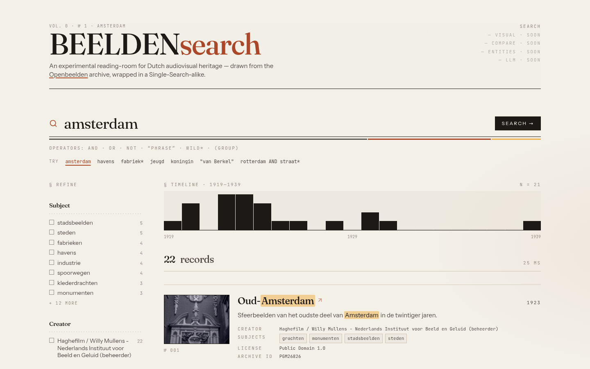
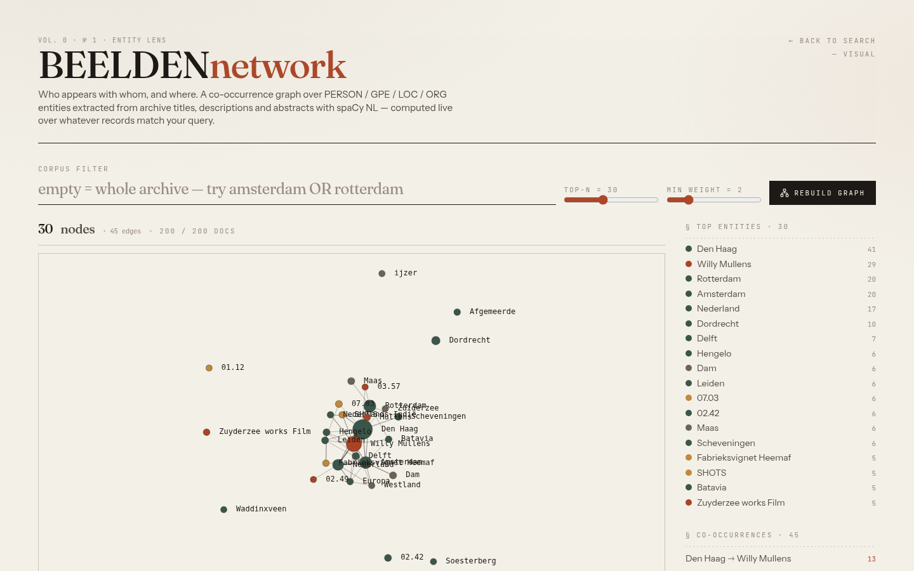
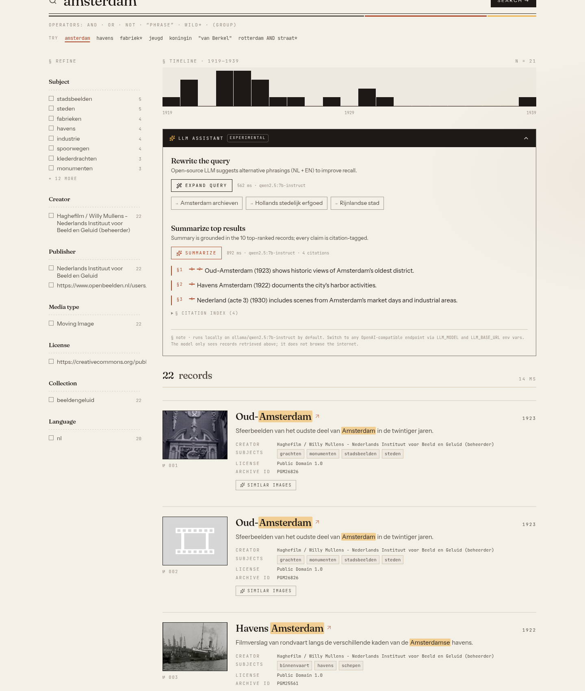
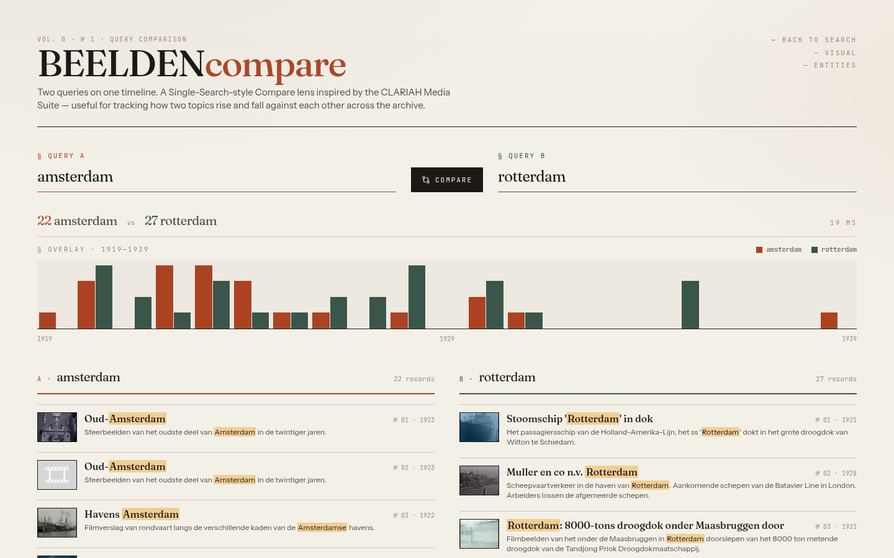

# BeeldenSearch

> An archival reading-room for Dutch audiovisual heritage — CLARIAH
> [Media Suite – Single Search](https://mediasuite.clariah.nl/tool/single-search)
> reimagined over the open [Openbeelden](https://www.openbeelden.nl/) corpus,
> with multimodal retrieval, spaCy entity networks, and open-source LLM
> assistance.

Built as a compact proof-of-concept for the **Research Engineer – Multimodal
Media Analytical Toolbox** role at ASCoR, University of Amsterdam.

---

## Feature tour

### 1 · Single-Search replica

Keyword search with Boolean operators (`AND` · `OR` · `NOT`), wildcards
(`stad*`, `bioscop?en`), exact phrases, and field-clustered scoring. Facets
update live; results render with Dutch-aware highlighting; the timeline is a
click-to-filter histogram.



### 2 · Visual · CLIP cross-modal retrieval

Natural-language → thumbnail, image upload → thumbnail, or "more like this"
from any record — all powered by [OpenCLIP](https://github.com/mlfoundations/open_clip)
ViT-B/32 / LAION-2B embeddings over a FAISS inner-product index. Warm text
query: ~9 ms. Image upload: ~180 ms. "Similar by id" (vector reconstruction
+ search): ~3 ms.

See [docs/clip-search.md](docs/clip-search.md) for the full pipeline
walkthrough (offline build + online query path + design tradeoffs).


### 3 · Entities · co-occurrence network

spaCy `nl_core_news_md` extracts PERSON · GPE · LOC · ORG over every title,
description and abstract. `/entity_graph` aggregates top-N entities by
document frequency for the current query, computes the pairwise
co-occurrence matrix in Python, and renders it with `react-force-graph-2d`.
Click a node → deep-link back into `/?q="<entity>"`.



### 4 · LLM · rewrite & summarize, citation-grounded

An inline, collapsible panel on the search page. Defaults to a local
`ollama/qwen2.5:7b-instruct`; swap to any OpenAI-compatible endpoint via
`LLM_MODEL` / `LLM_BASE_URL` / `LLM_API_KEY`.

- **Expand query** returns 3 alternative phrasings (NL + EN) as clickable
  pills that re-shoot the main query on click.
- **Summarize** fetches the top-10 hits, asks the model for exactly 3
  bullets, and enforces `[n]` citation tags so every factual claim in the
  summary links back to a concrete record.



### 5 · Compare · two queries, one timeline

Mirrors the Media Suite *Compare* tool. Two searches run in parallel, share
a single year axis, and surface stacked result columns. URL-synced — shared
link carries both queries.



---

## How this maps to the CLARIAH Media Suite

| Media Suite tool       | Here                       |
|------------------------|----------------------------|
| Single Search          | `/`                        |
| Query Comparison       | `/compare`                 |
| Explore (thumb grid)   | `/visual` (CLIP-ranked)    |
| –                      | `/entities` (CCS extension)|
| –                      | LLM panel (inline, `/llm/*`) |

---

## Architecture

```
 ┌──────────────────────┐
 │ OAI-PMH harvester    │  (data_pipeline/harvest.py)
 └─────────┬────────────┘
           ▼
 ┌──────────────────────┐      ┌───────────────────────┐
 │ Enrich pipeline      │─────▶│ data/enriched/*.jsonl │
 │  · thumbnail download│      │ data/thumbnails/*.png │
 │  · spaCy NL NER      │      │ data/faiss/*.{index,pkl}
 │  · CLIP img embed    │      └───────────────────────┘
 └─────────┬────────────┘
           ▼
 ┌──────────────────────┐      ┌──────────────────────┐
 │ Indexer              │─────▶│ OpenSearch 2.15       │
 │                      │      │ FAISS index (pickle)  │
 └──────────────────────┘      └──────────┬───────────┘
                                          ▼
                               ┌──────────────────────┐
                               │ FastAPI backend      │
                               │  /search             │
                               │  /timeline_agg       │
                               │  /multimodal_search  │
                               │  /entity_graph       │
                               │  /llm/expand_query   │
                               │  /llm/summarize      │
                               └──────────┬───────────┘
                                          ▼
                               ┌──────────────────────┐
                               │ Next.js 14 (App Rtr) │
                               │  + Tailwind + shadcn │
                               │  + react-force-graph │
                               └──────────┬───────────┘
                                          ▼
                               ┌──────────────────────┐
                               │ Ollama + litellm     │
                               │ qwen2.5:7b-instruct  │
                               │ (switchable)         │
                               └──────────────────────┘
```

See [DESIGN.md](DESIGN.md) for the detailed design rationale.

---

## Quick start

### Option A · `docker compose` (clean machine)

```bash
git clone <this repo>
cd beeldensearch
cp .env.example .env

docker compose up -d                  # opensearch + ollama + backend + frontend

# one-shot harvest + enrich + index (host side — uses the mounted data/ dir)
pip install -e ".[dev]"
python -m data_pipeline.harvest --limit 1500 --only-with-thumbnail
python -m data_pipeline.download_thumbnails \
    --input data/raw/openbeelden-YYYYMMDD.jsonl
python -m data_pipeline.enrich_ner \
    --input  data/raw/openbeelden-YYYYMMDD.jsonl \
    --output data/enriched/openbeelden-YYYYMMDD.jsonl
python -m data_pipeline.embed_clip \
    --records data/enriched/openbeelden-YYYYMMDD.jsonl
python -m data_pipeline.index_opensearch \
    --input data/enriched/openbeelden-YYYYMMDD.jsonl --recreate

docker compose exec ollama ollama pull qwen2.5:7b-instruct

open http://localhost:3000
```

### Option B · native dev (matching the HPC dev machine)

Useful when `docker compose` is unavailable (e.g. podman rootless without
subuid ranges):

```bash
# OpenSearch
curl -LO https://artifacts.opensearch.org/releases/bundle/opensearch/2.15.0/opensearch-2.15.0-linux-x64.tar.gz
tar -xzf opensearch-2.15.0-linux-x64.tar.gz
# disable security for local dev; see docker-compose.yml for the config
opensearch-2.15.0/bin/opensearch &

# Ollama
curl -LO https://github.com/ollama/ollama/releases/download/v0.21.0/ollama-linux-amd64.tar.zst
zstd -d ollama-linux-amd64.tar.zst && tar -xf ollama-linux-amd64.tar
LD_LIBRARY_PATH=$PWD/lib/ollama ./bin/ollama serve &
./bin/ollama pull qwen2.5:7b-instruct

# Backend + pipeline
pip install -e ".[dev]"
python -m spacy download nl_core_news_md
python -m data_pipeline.harvest --limit 1500 --only-with-thumbnail
# ...same enrich / embed / index steps as above...
python -m uvicorn backend.app.main:app --host 127.0.0.1 --port 8000 &

# Frontend
cd frontend && npm install && npm run build && npm start
```

---

## Development

```bash
ruff check . && ruff format --check .
pytest -q                              # 26 backend tests

cd frontend && npx next build          # typecheck + lint + build
```

CI runs the same gates on every push (`.github/workflows/ci.yml`).

---

## Tech stack

| Layer | Choice |
|---|---|
| Harvester | Python 3.11 · `httpx` · `lxml` · `tenacity` |
| NER | `spacy` + `nl_core_news_md` |
| Embeddings | `open_clip` ViT-B/32 · LAION-2B |
| Vector store | `faiss-cpu` + pickle |
| Search | OpenSearch 2.15, Dutch + English analyzers |
| Backend | FastAPI · `pydantic` v2 · `opensearch-py` · `litellm` |
| LLM runtime | Ollama (local) or any OpenAI-compatible endpoint |
| Frontend | Next.js 14 App Router · Tailwind · `react-force-graph-2d` |
| Orchestration | `docker-compose.yml` with OpenSearch + Ollama + backend + frontend |
| Quality | `ruff`, `pytest`, GitHub Actions CI |

---

## Data & ethics

All records come from [Openbeelden](https://www.openbeelden.nl/) under
Creative Commons licenses. Attribution is preserved per-record; UI links
back to the original archive page. See [DATA_ETHICS.md](DATA_ETHICS.md) for
the full statement, including responsible-AI notes on the LLM panel.

---

## Status & roadmap

**Shipped** — P0 Single-Search replica, P1 CLIP cross-modal, P2 entity
network, P3 LLM panel with grounded summarization, P4 Compare tool,
`docker-compose.yml`, CI, 26 backend tests.

**Intentionally stubbed** — `mypy --strict` across the codebase (open_clip
and faiss lack type stubs; deferred). Only a 200-record sample is indexed
by default — the pipeline is tested to scale, the cap is a demo choice.

**Roadmap** — plug in ASR / OCR for true within-record text search;
widen to Delpher (Dutch newspapers, KB) for a cross-archive view; swap
FAISS for pgvector if entity metadata grows past ~50k items; add a
recharts-based term distribution chart next to the timeline.
